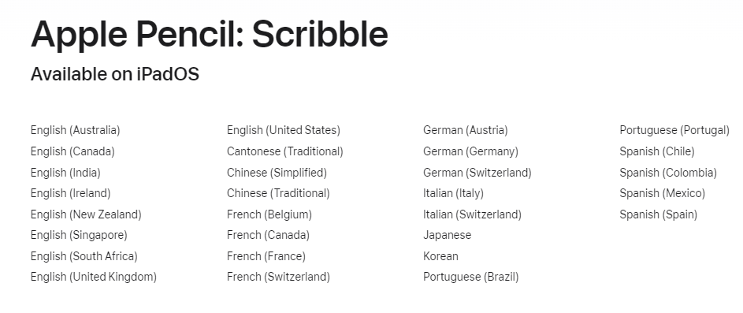
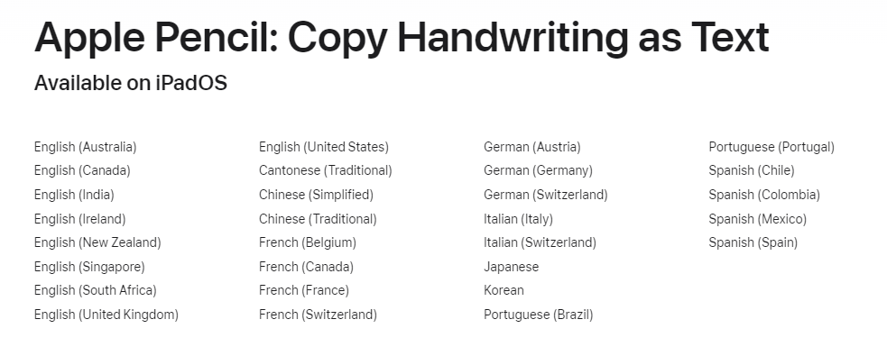
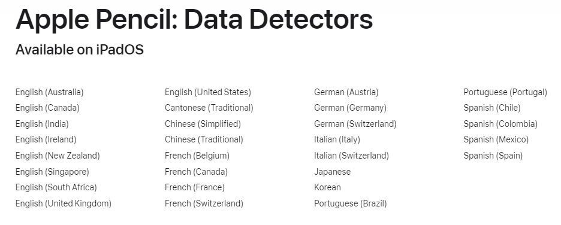
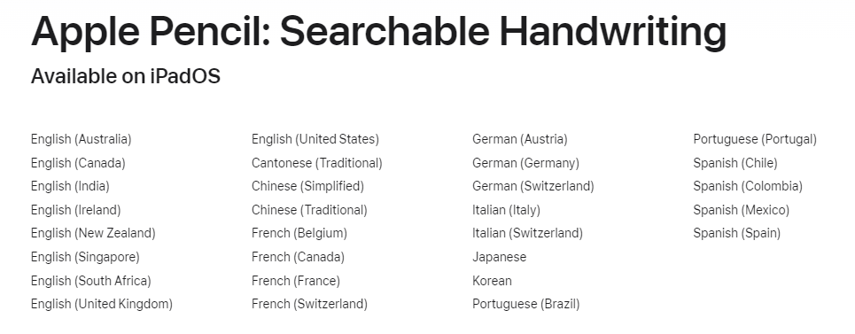

# Tools

# Microsoft

# Apple

## IPadOS

### Apple Scribble

Apple Scribble does not support comma or other puncutation.

- [Forum post](https://discussions.apple.com/thread/252411080)
- [Support guide](https://support.apple.com/guide/ipad/enter-text-with-scribble-ipad355ab2a7/ipados)
- [Language support](https://www.apple.com/ios/feature-availability/#apple-pencil-scribble)

# MyScript

- [Homepage](https://www.myscript.com/)

# Notes

- Recognition is limited to single language
- Recognized languages are added by the time
- Support for the mixed text and shapes exist, but even then for one language at the time
